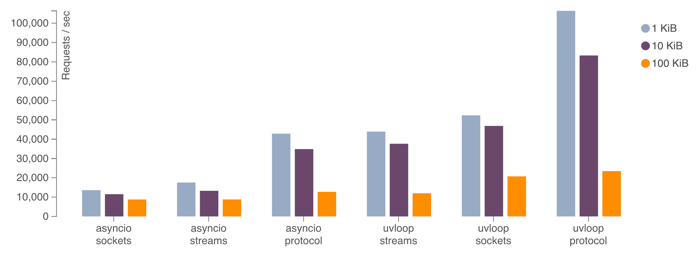

.. image:: https://travis-ci.org/MagicStack/uvloop.svg?branch=master
    :target: https://travis-ci.org/MagicStack/uvloop

.. image:: https://ci.appveyor.com/api/projects/status/4apd79e5jqrwwe40/branch/master?svg=true
    :target: https://ci.appveyor.com/project/MagicStack/uvloop

.. image:: https://img.shields.io/pypi/v/uvloop.svg
    :target: https://pypi.python.org/pypi/uvloop

uvloop is a fast, drop-in replacement of the built-in asyncio
event loop.  uvloop is implemented in Cython and uses libuv
under the hood.

The project documentation can be found
`here <http://uvloop.readthedocs.org/>`_.  Please also check out the
`wiki <https://github.com/MagicStack/uvloop/wiki>`_.

Performance
-----------

uvloop makes asyncio 2-4x faster.

The above chart shows the performance of an echo server with different
message sizes.  The *sockets* benchmark uses ``loop.sock_recv()`` and
``loop.sock_sendall()`` methods; the *streams* benchmark uses asyncio
high-level streams, created by the ``asyncio.start_server()`` function;
and the *protocol* benchmark uses ``loop.create_server()`` with a simple
echo protocol.  Read more about uvloop
`performance <http://magic.io/blog/uvloop-blazing-fast-python-networking/>`_.

Installation
------------

uvloop requires Python 3.5 or greater and is available on PyPI.
Use pip to install it::

    $ pip install uvloop

Using uvloop
------------

To make asyncio use uvloop, you can install the uvloop event
loop policy:

.. code:: python

    import asyncio
    import uvloop

    asyncio.set_event_loop_policy(uvloop.EventLoopPolicy())

Building From Source
--------------------

To build uvloop, you'll need Python 3.5 or greater:

1. Clone the repository:

   .. code::

    $ git clone --recursive git@github.com:MagicStack/uvloop.git
    $ cd uvloop

2. Create a virtual environment and activate it, for example:

   .. code::

    $ python3.7 -m venv uvloop-dev
    $ source uvloop-dev/bin/activate

3. Install development dependencies:

   ..  code::

    $ pip install -r requirements.dev.txt

4. Build and run tests:

   .. code::

    $ make && make test

License
-------

uvloop is dual-licensed under MIT and Apache 2.0 licenses.
